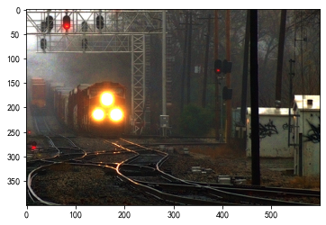
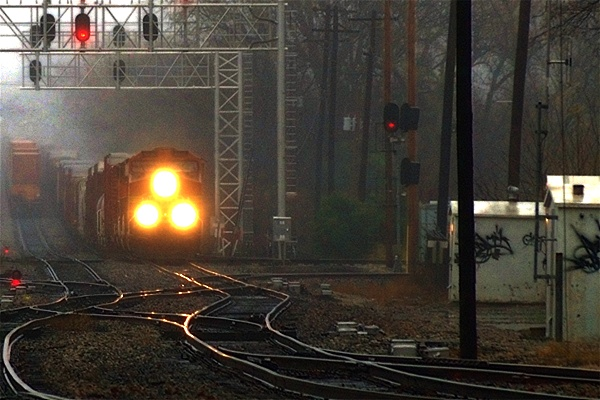

# 图像去雾实验报告

## 实验任务

对输入的有雾图像去雾，输出去雾后的图像。

## 实验方法

实现了两种去雾算法，分别为直方图均衡化方法和基于暗通道先验的去雾算法。前者实现简单、效果较差，作为对比的 baseline；后者实现相对复杂，实验证明去雾效果与参考结果相近。

### 使用直方图均衡化方法去雾

对输入图像的三个通道分别做直方图均衡化，核心代码如下：

```python
(r, g, b) = cv2.split(img)
rh = cv2.equalizeHist(r)
gh = cv2.equalizeHist(g)
bh = cv2.equalizeHist(b)
img = cv2.merge((rh, gh, bh))
```

由于这种方法对三个颜色通道分别单独处理，改变了颜色分布，因此去雾后的图像与参考结果相比颜色偏差较大。这可以从下面的对比图中看出。

原始图像：


参考结果：


直方图均衡化去雾结果：


### 使用暗通道先验去雾

直方图均衡化去雾方法的色差问题较难解决，因此我又实现了基于暗通道先验的去雾算法。该算法原理不再赘述，具体包含以下几个步骤。

#### 获取暗通道图

对每个像素点选取三个颜色通道中最小的值作为暗通道图的像素值。

```python
def get_dark_channel(img, plot=False):
    """
    dark channel prior
    """
    r, g, b = cv2.split(img)
    dark_chn = cv2.min(cv2.min(r, g), b) / 255
    if plot:
        plt.imshow(dark_chn, cmap='gray')
        plt.show()
    return dark_chn
```

#### 暗通道图平滑处理

原始暗通道图存在大量高频细节，若直接反转作为透射率图，会导致去雾后的图像丢失细节。因此，我们需要对暗通道图做平滑处理。

在原始论文中，作者选取了一个邻域小窗口内的最小值来作为暗通道。我也实现了这种方法，具体代码如下：

```python
def rect_erode(dark_chn, size=10, plot=False):
    """
    erode image with rectangle kernel

    designed for dark channel method
    to choose the darkest pixel in a rectangle neighborhood window
    """
    kernel = cv2.getStructuringElement(cv2.MORPH_RECT, (size, size))
    # print(kernel)
    dark_chn_eroded = cv2.erode(dark_chn, kernel)
    if plot:
        plt.imshow(dark_chn_eroded, cmap='gray')
        plt.show()
    return dark_chn_eroded
```

其中，`size` 参数表示邻域窗口的大小。

但通过实验，我发现使用这种方法会导致去雾后的图像出现白边——这是符合预期的，因为这种方法扩散了暗通道图中低亮区域，使得物体边缘附近的暗通道值偏低，透射率偏高，去雾效果变差——表现为白边。

处理前的暗通道图：


处理后的暗通道图（为了凸显问题，扩大了窗口大小）：


结果中的白边：


如果适当缩小窗口大小，白边宽度会减小，但依旧十分明显；于此同时，去雾效果也会变差。因此，作者后续借助抠图问题的思想，设计了一系列方法来细调透射率，或对透射率图进行导向滤波。这里我没有延续作者的方法，而是采用了另一种思路：使用双边滤波/中值滤波来平滑暗通道图。

双边滤波和中值滤波相比简单地高斯模糊或最小值模糊，能在平滑图片的同时较好地保留边缘信息。（我也曾尝试将暗通道图进行低通滤波：利用傅里叶变换和逆傅里叶变换在频域滤去高频区域而保留低频细节，然而处理结果带有大量噪声，边缘不再锐利）

双边滤波的代码实现如下：

```python
def bilateral_filter(img, size=5, plot=False):
    """
    bilateral filter method
    """
    img = img * 255
    img = img.astype(np.uint8)
    img = cv2.bilateralFilter(img, size, 135, 75)
    img = img / 255
    if plot:
        plt.imshow(img, cmap='gray')
        plt.show()
    return img
```

中值滤波的代码实现如下：

```python
def median_filter(img, size=5, plot=False):
    """
    median filter method
    """
    img = img * 255
    img = img.astype(np.uint8)
    img = cv2.medianBlur(img, size)
    # img = cv2.medianBlur(img, size)
    img = img / 255
    if plot:
        plt.imshow(img, cmap='gray')
        plt.show()
    return img
```

实验表明，这两种滤波的效果相近，都能有效减少白边的出现。在后续实验中，我使用了双边滤波。

#### 获取透射率图

这块的代码实现比较简单，直接反转暗通道图即可，`omega` 用于调节去雾程度。

```python
def get_transmission(dark_chn, omega=0.95, plot=False):
    """
    estimate transmission map from dark channel prior

    omega: a constant to control the degree of haze removal
    """
    transmission = 1 - omega * dark_chn
    if plot:
        plt.imshow(transmission, cmap='gray')
        plt.show()
    return transmission
```

#### 获取大气光强度

大气光强度 `A` 来自暗通道图中亮度最高的前1%像素点的三通道颜色均值。在估算 `A` 前，我对暗通道图做了额外改进，来确保暗通道图中的最亮像素点大雾浓度最高。具体预处理见实验结果与改进部分。

获取大气光强度的代码实现如下：

```python
def get_A(img, dark_chn, br_ratio=0.01, plot=False):
    """
    estimate atmospheric light A

    A is the pixel with maximum intensity in the original image
    """
    if br_ratio is not None:
        # use the top brightest pixels to estimate A
        top_num = int(br_ratio * img.shape[0] * img.shape[1])
        indices = np.argsort(dark_chn, axis=None)
        r = np.take_along_axis(img[:,:,0], indices[-top_num:], axis=None).mean()
        g = np.take_along_axis(img[:,:,1], indices[-top_num:], axis=None).mean()
        b = np.take_along_axis(img[:,:,2], indices[-top_num:], axis=None).mean()
        A = np.array([r, g, b])
    else:
        # use the top 1 brightest pixel to estimate A
        indices = np.where(dark_chn == np.max(dark_chn))
        i = indices[0][0]
        j = indices[1][0]
        # print('i: ', i)
        # print('j: ', j)
        A = img[i, j]
    
    if plot:
        print('A =', A)
    return A
```

当显示指明 `br_ratio` 时，使用比例为 `br_ratio` 的前若干个最亮像素点的颜色均值来估算 `A`；否则，使用最亮像素点的颜色作为 `A`。

#### 获取去雾图

$$\mathbf{J}(\mathbf{x})=\frac{\mathbf{I}(\mathbf{x})-\mathbf{A}}{\max \left(t(\mathbf{x}), t_0\right)}+\mathbf{A}$$

根据上述公式计算即可。

```python
def get_dehazed(img, transmission, A, t0=0.1, plot=False):
    """
    dehaze image

    t0: a constant to avoid division by zero
    """
    dehazed = np.zeros(img.shape)
    dehazed = (img.astype(np.int32) - A.astype(np.int32)) / \
        transmission_map(np.maximum(transmission, t0))[:, :, np.newaxis] + \
        A.astype(np.int32)
    dehazed = np.clip(dehazed, 0, 255).astype(np.uint8)
    # print('dehazed: ', dehazed)
    if plot:
        plt.imshow(dehazed)
        plt.show()
    return dehazed
```

## 实验结果与改进

### 大气光强估算输入图的预处理

如果将前文所述的经双边滤波后的暗通道图直接作为大气光强估算的输入图像，会导致大气光强估算的结果不准确。

例如，对于输入图像hongkong，不做任何预处理的输出去雾图如下：


此时的参考结果为：


又如，对于输入图像train，不做任何预处理的输出去雾图如下：


此时的参考结果为：


可以看到，去雾图中出现了色差。

经过反复对比分析后，我发现色差问题的直接原因来自大气光强估算不准确，其根本原因在于输入的暗通道图中包含了大量高频细节。这些细节中带有高亮度的像素点，这些像素点在大气光强估算中被当作大气光强的一部分，从而导致了大气光强的估算不准确。

解决方案是通过模糊操作去除暗通道图中的高频细节。我最终选用了窗口邻域最小值滤波和高斯滤波的叠加，并使用了大卷积核，来实现模糊操作。注意这里的暗通道处理只用于大气光强估算，而不用于透射率的求解，以保证透射率边缘的锐利（避免出现前文所述的白边）。相比透射率的求解，大气光强估算对暗通道图的边缘锐利程度要求不高，只需根据暗通道图找到亮度最高的一些像素点，因此可以使用模糊操作。

对于hongkong，经处理后的暗通道图如下：


对应的去雾图为：


对于train，经处理后的暗通道图如下：


对应的去雾图为：


可以看到，通过预处理大气光强估算输入图，我们可以得到和参考结果相近的无色差去雾图。


### 大气光强估算比例 `br_ratio` 的选择

在计算大气光强 `A` 中，我们需要确定超参数 `br_ratio` 的值。该值用于确定使用前多少的最亮像素点来估算 `A`。

`br_ratio` 的值不宜过大。例如当 `br_ratio` 取0.1时，一些远处细节会被忽略，如下图所示（输入图为gugong）：


对应的原始图像为：


可以看到，在原始图像中依稀可见的远处建筑细节被忽略了。而在参考结果中，这部分细节是存在的：


适当调小 `br_ratio` 的值。当 `br_ratio` 取0.01时，我们也能取得和参考结果类似的结果：


### 自适应重复迭代去雾

在实验过程中，我还发现了对于某些图像，如果重复迭代去雾，效果会更好。

例如下面这张来自canon3，是迭代一次的结果：


迭代两次的结果如下：


可以看到对于中远处的建筑，迭代两次的结果更清晰、效果更好，也跟接近参考图像。

然而并非对于所有图像都是重复迭代去雾的效果更好。

例如下面这张来自canyon2，迭代一次的结果如下：


迭代两次的结果如下：


可以看到迭代两次的图像中天空出现了噪点，整幅图像偏暗，中远处的细节出现了丢失。

显然，如果手动为每幅图寻找最合适的迭代次数是不优雅的，我们可以借助图像的一些特征来自适应地决定是否继续迭代去雾。

我发现，如果暗通道图中所有像素点亮度平均值大于某个阈值，那么继续迭代去雾的效果会更好。由此作为判断是否继续迭代的依据。通过实验，我将这里的阈值设为 `0.35`。实验表明，在这个阈值下，对于所有测试集里的图像，均能自适应地选择最佳的迭代次数。

### 附：最终结果

最终结果如下：
canon 原始图像：


canon 去雾图像：


canon 参考图像：


canyon 原始图像：


canyon 去雾图像：


canyon 参考图像：


forest 原始图像：


forest 去雾图像：


forest 参考图像：


gugong 原始图像：


gugong 去雾图像：


gugong 参考图像：


hongkong 原始图像：


hongkong 去雾图像：


hongkong 参考图像：


ny1 原始图像：


ny1 去雾图像：


ny1 参考图像：


ny3 原始图像：


ny3 去雾图像：


ny3 参考图像：


tiananmen 原始图像：


tiananmen 去雾图像：


tiananmen 参考图像：


train 原始图像：


train 去雾图像：


train 参考图像：

