# 图像拼接实验报告

## 实验任务

输入两幅相同机位，不同视角拍摄的图片。输出两者拼接结果。

## 实验方法

我首先实现了将右图线性拉伸后拼接到左图上的算法。这可以切分成六个步骤：
- 寻找左右两图的特征点
- 匹配左右两图的特征点
- 计算变换矩阵
- 拉伸右图
- 计算拼接权重图
- 按权重图，拼接左右图

在后续实验中，我通过翻转并交换输入的两图像，经过同样的函数，可以得到左图拼接到右图上的输出结果（只要输出时再经过一次翻转即可）。

下面具体逐个介绍上述的若干步骤。

### 寻找特征点

使用了SIFT（尺度不变特征变换）来提取特征点。这里借助了 `opencv-contrib-python` 库来实现。返回值 `kp` 描述了各个特征点的信息， `des` 保存了每个特征点的128维特征。

```python
def sift_kp(img):
    """
    use SIFT to find keypoints
    """
    sift = cv2.xfeatures2d.SIFT_create()
    kp, des = sift.detectAndCompute(img, None)
    # 参考网页：OpenCV - SIFT 参数及计算返回结果说明
    # https://www.aiuai.cn/aifarm1639.html
    return kp, des
```

这里以第三张侧视图为例，使用下述代码绘制关键点到原图上（其中 `left` 和 `right` 分别表示左右图数据）：

```python
left_kp_img = cv2.drawKeypoints(left, left_kp, None)
right_kp_img = cv2.drawKeypoints(right, right_kp, None)
plt.imshow(left_kp_img)
plt.show()
plt.imshow(right_kp_img)
plt.show()
```

绘制结果如下（由于特征点较密较小，建议放大观测）：


对于本次测试，左图包含了29561个特征点，右图包含了37745个特征点。

### 缓存数据

由于特征点寻找以及之后的匹配较为耗时，为了方便调试时复用先前结果，我选择将数据以 pickle 的格式保存到 `cache` 目录下。

我首先封装了下 pickle 文件的加载与保存函数：

```python
def load_from_pkl(path):
    """
    load data from pkl file
    """
    with open(path, "rb") as f:
        data = pickle.load(f)
    return data

def save_to_pkl(data, path):
    """
    save data to pkl file
    """
    with open(path, "wb") as f:
        pickle.dump(data, f)
```

随后，我定义了包裹器函数，以接收“生成数据的方法”以及“数据的保存路径”：

```python
def pkl_cache(func, path):
    """
    cache data to pkl file
    """
    def wrapper(*args, **kwargs):
        if os.path.exists(path):
            print("load data from cache: ", path)
            data = load_from_pkl(path)
        else:
            data = func(*args, **kwargs)
            print("save data to cache: ", path)
            save_to_pkl(data, path)
        return data
    return wrapper
```

当所需的数据存在于指定路径下时，程序将直接读取该路径下的结果；否则，程序将调用数据的生成方法，并将生成的数据保存到指定路径下，以供复用。

借助上述实现，我们可以改写特征点寻找代码（以及类似地更改后续的特征点匹配代码）以方便地复用数据。

```python
# find keypoints

# 修改前
left_kp, left_des = sift_kp(left)
right_kp, right_des = sift_kp(right)

# 修改后
# finding keypoints is time-consuming, so we cache the result
left_kp, left_des = pkl_cache(sift_kp, os.path.join(cache_path, "left_kp"+save_suffix+".pkl"))(left)
right_kp, right_des = pkl_cache(sift_kp, os.path.join(cache_path, "right_kp"+save_suffix+".pkl"))(right)
```

后续特征点匹配的结果也可以用类似的方法复用，这里不再赘述。所有缓存结果都位于 `cache` 目录下。

值得注意的是，对于 `cv2.KeyPoint` 和 `cv2.DMatch` 类型的数据，使用pickle直接保存会出错。这里参考了 [python - Pickling cv2.KeyPoint causes PicklingError - Stack Overflow](https://stackoverflow.com/questions/10045363/pickling-cv2-keypoint-causes-picklingerror) 的解决方案，在代码中添加了下述内容：

```python
# https://stackoverflow.com/questions/10045363/pickling-cv2-keypoint-causes-picklingerror
import copyreg
def _pickle_keypoints(point):
    return cv2.KeyPoint, (*point.pt, point.size, point.angle,
                          point.response, point.octave, point.class_id)
def _pickle_dmatch(match):
    return cv2.DMatch, (match.queryIdx, match.trainIdx, match.distance)
copyreg.pickle(cv2.KeyPoint().__class__, _pickle_keypoints)
copyreg.pickle(cv2.DMatch().__class__, _pickle_dmatch)
```

### 特征点匹配

特征点匹配使用了 Brute-Force 思想和 KNN 算法。这里 `k` 值取2，表示匹配和原图特征点最相近的两个特征点。之所以匹配两个特征点是为了后续评价匹配的优劣性。

特征点匹配的实现如下：

```python
def match_kp(des1, des2):
    """
    match keypoints
    """
    bf = cv2.BFMatcher()
    matches = bf.knnMatch(des1, des2, k=2)
    return matches
```

这里接收的两个 `des` 分别来自上一步左图和右图的特征点描述符。

仍以第三张图为例，在这一步，我们得到了 29561 个匹配对。如果直接使用这些匹配对计算右图到左图的变换矩阵将及其耗时、且误差较大——需要从中挑选出一批优秀的匹配。

这里便使用了 `k` 取2带来的便利。一个好的匹配被定义为一个“唯一合适”的匹配——这样能确保尽量高的置信与尽量低的误差。“唯一合适”体现在该匹配点不仅是距离待匹配点（特征）距离最近的点，还比第二名的距离好出一大截。

```python
def get_good_matches(matches, ratio=0.75):
    """
    get good keypoint matches
    """
    good = []
    for m, n in matches:
        if m.distance < ratio*n.distance:
            good.append(m)
    return good
```

在经过这一步筛选后，我们将原始的 29561 个配对降低为了 1836 个配对。

通过下述代码提取、筛选并可视化配对：

```python
# match keypoints
# matching keypoints is time-consuming, so we cache the result
matches = pkl_cache(match_kp, os.path.join(cache_path, "matches"+save_suffix+".pkl"))(left_des, right_des)
# matches = match_kp(left_des, right_des)
print("matches number: ", len(matches))
good = get_good_matches(matches, ratio=0.5)
print("good matches number: ", len(good))
img_match = cv2.drawMatches(left, left_kp, right, right_kp, good, None, flags=2)
plt.imshow(img_match)
plt.show()
```

结果如下：


可以看到，绝大部分配对的方向是一致的（这里的“一致”不是简单地指“平行”，而是表示符合“线性变换”的假设）。

### 计算变换矩阵

接下来，我们需要根据所有匹配点对，计算右图到左图的变换矩阵。这通过 OpenCV 的 `findHomography` 函数实现：

```python
# calculate homography matrix
left_good_kp = np.float32([left_kp[m.queryIdx].pt for m in good]).reshape(-1, 1, 2)
right_good_kp = np.float32([right_kp[m.trainIdx].pt for m in good]).reshape(-1, 1, 2)
# 参考网页：findHomography()函数详解
# https://blog.csdn.net/fengyeer20120/article/details/87798638
M, mask = cv2.findHomography(right_good_kp, left_good_kp, cv2.RANSAC, 5.0)
print("M: ", M)
print("mask shape: ", mask.shape)
```

由此得到了一个3x3的变换矩阵 `M` 和一个配对的掩码 `mask`。

```python
M:  [[ 9.94252142e-01  1.46449450e-02  1.37730531e+03]
 [-2.13791168e-02  9.95544317e-01  5.92381567e+02]
 [-8.67874432e-07 -6.44934789e-07  1.00000000e+00]]
mask shape:  (1836, 1)
```

### 拉伸右图

在计算变换矩阵后，我们将右图根据刚得到的结果进行拉伸，使得右图和左图对应起来。这通过 OpenCV 的 `perspectiveTransform` 和 `warpPerspective` 函数来实现。

首先计算变换后右图的大小：

```python
# warp perspective
# get size
h, w = right.shape[:2]
# calc size after warp
right_corners = np.float32([[0, 0], [0, h-1], [w-1, h-1], [w-1, 0]]).reshape(-1, 1, 2)
left_corners = cv2.perspectiveTransform(right_corners, M)
print("left_corners: ", left_corners)
h_max = max(left_corners[0][0][1], left_corners[1][0][1], left_corners[2][0][1], left_corners[3][0][1])
w_max = max(left_corners[0][0][0], left_corners[1][0][0], left_corners[2][0][0], left_corners[3][0][0])
h_min = min(left_corners[0][0][1], left_corners[1][0][1], left_corners[2][0][1], left_corners[3][0][1])
w_min = min(left_corners[0][0][0], left_corners[1][0][0], left_corners[2][0][0], left_corners[3][0][0])
h_min = max(h_min, 0)
w_min = max(w_min, 0)
print("h_max: ", h_max)
print("w_max: ", w_max)
print("left shape: ", left.shape)
print("right shape: ", right.shape)
h_bigger = max(left.shape[0], h_max)
w_bigger = max(left.shape[1], w_max)
print("h_bigger: ", h_bigger)
print("w_bigger: ", w_bigger)
```

在知道变换后右图大小后，我们可以确定画布尺寸，从而根据变换矩阵 `M` 拉伸右图：

```python
img_out = cv2.warpPerspective(right, M, (int(w_bigger), int(h_bigger)))
# img_out = cv2.warpPerspective(right, M, (left.shape[1]+right.shape[1], left.shape[0]))
plt.imshow(img_out)
plt.show()
```

拉伸结果如下：
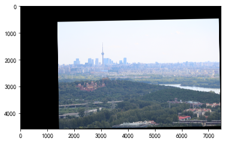

### 计算权重与拼接

我们首先对拉伸后的右图进行二值化处理，得到一个黑白的 `mask` 图像。通过切除 `mask` 中不在左图的部分，我们得到了左右两图的重叠：

```python
# get mask
mask = cv2.threshold(cv2.cvtColor(img_out, cv2.COLOR_RGB2GRAY), 0, 255, cv2.THRESH_BINARY)[1] / 255
mask[left.shape[0]:, :] = 0
mask[:, left.shape[1]:] = 0
print("mask shape: ", mask.shape)
plt.imshow(mask, cmap="gray")
plt.show()
```

对于第三张测试图，它的重叠部分 `mask` 图如下：

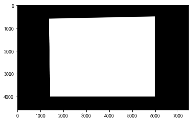

#### 重叠部分位置无关拼接——效果较差

显然，对于左右两图的非重叠部分，我们可以直接判断使用哪个图像。但是，对于重叠部分，我们不能简单地选择使用两图中的某一个，也不能简单地平均二者——这可以从下述实验中看出。

##### 重叠部分采用左图

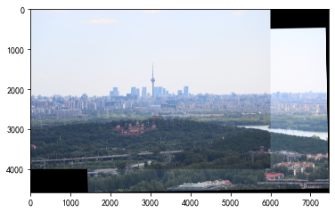

可以看到，重叠部分右下边缘处拼接痕迹明显。

##### 重叠部分采用右图

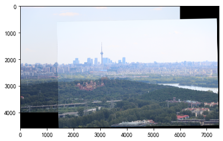

可以看到，重叠部分左上边缘处拼接痕迹明显。

##### 重叠部分取左右图平均

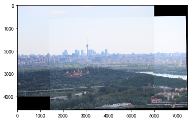

可以看到，重叠部分四边均有拼接痕迹。

#### 重叠部分位置加权拼接——效果较好

一个很自然的思想是，我们可以根据重叠部分内各个像素点相对于左右图的位置，来赋予它们不同的权重。在拼接时，我们根据这个权重值来调和左右图的像素值。这样，我们就可以得到一个更好的拼接效果。

```python
# add mask to weight
weight = (mask * weight_out).reshape(mask.shape[0], mask.shape[1], 1)
print("weight shape: ", weight.shape)
plt.imshow(weight, cmap="gray")
plt.show()

# stitch
weight = weight[0:left.shape[0], 0:left.shape[1], :]
img_out[0:left.shape[0], 0:left.shape[1]] = \
    left * (1 - weight) + img_out[0:left.shape[0], 0:left.shape[1]] * weight
```

由此，原始拼接问题就转化为了一个权重计算问题。

##### 左右线性渐变加权

我首先尝试了一个简单的线性渐变加权方案。这基于一个简单的观察：重叠部分靠近左图的部分，应该更多地使用左图像素；重叠部分靠近右图的部分，应该更多地使用右图像素。此时，针对第三张测试图，权重图如下：

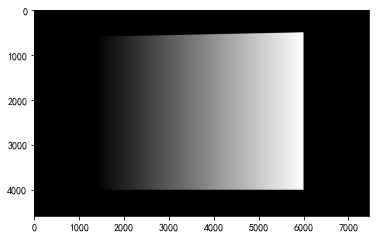

对应的拼接结果如下：

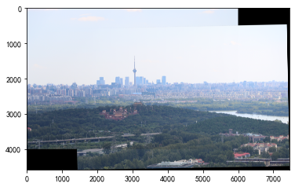

可以看到，对于重叠部分的左右边缘，拼接痕迹已经几乎看不出来了。但是，在右上角，还是出现了明显的横线。

这个横线的出现是符合预期的。因为，简单地使用左右线性渐变加权方式，只能确保左边缘接近左图像素，右边缘接近右图像素，而忽视了上下边缘。对于上述测试图，我们还需要让上边缘接近上图像素，下边缘接近下图像素。

因此，针对这次测试，**一个理想的权重图应该要让靠近上边缘和左边缘的像素尽可能地黑，靠近下边缘和右边缘的像素尽可能地白。**

##### 左右非线性渐变加权

我也尝试使用指数函数对权重图进行处理，以期望让权重图内的白色部分更少，从而试图减少上边缘右侧的拼接痕迹。

此时的权重图如下：

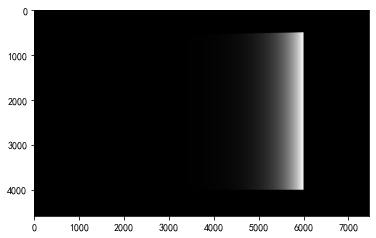

对应的拼接结果如下：


可以看到，上边缘的拼接痕迹显著减少了，但于此同时牺牲了右边缘的光照一致性，同时下边缘的拼接痕迹明显增加。这也是符合预期的，因为我们还是局限于调整左右权重的分布，而忽视了上下权重的变化。

##### 权重渐变函数

在进一步介绍改进方法前，我先精心设计了几个函数。

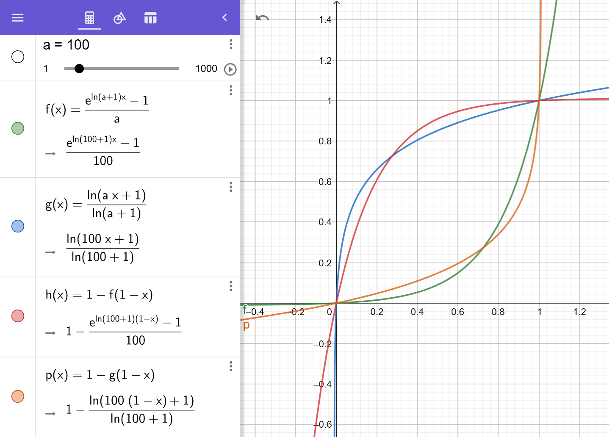

我们将函数的 `x` 视作某一维度的位置坐标（例如可以表示坐标的从左到右的变化量/从上到下的变化量），将函数的 `y` 视作相应的权重（权重图中的亮度）。

这些函数分别具有以下性质：
- 绿色函数（f）：维持较长的纯黑区域，在代码中取名为 `long_dark_map`
- 蓝色函数（g）：黑色区域极短，在代码中取名为 `short_dark_map`
- 红色函数（h）：维持较长的纯白区域，在代码中取名为 `long_light_map`
- 橙色函数（p）：白色区域极短，在代码中取名为 `short_light_map`

##### 为重叠部分的每条边缘设计权重图

根据先前的分析，针对第三张测试图，我们需要让权重图中靠近上边缘和左边缘的像素尽可能黑，靠近右边缘和下边缘的像素尽可能白。然而，这样的优化目标实际上是矛盾的——这体现在左下角和右上角的权重选择上。这两个边角区域也恰恰是最容易出现拼接痕迹的地方。边角处的拼接痕迹分为横线与纵线两种，两者优化相互矛盾，我们只能尽可能地调整权重图，来达到某种平衡或是 trade-off。

我首先求出了重叠部分从上到下的坐标变化与从左到右的坐标变化，作为上述“权重渐变函数”的输入。

```python
lb = left_bound
rb = right_bound
lr_lin = (np.arange(0, rb-lb)/(rb-lb)).reshape(1, -1)
tb = top_bound
bb = bottom_bound
tb_lin = (np.arange(0, bb-tb)/(bb-tb)).reshape(-1, 1)
```

接着，我为重叠部分的每条边缘设计了理想的权重图。

- 上边缘

由于重叠部分的上边缘位于左图内，我们需要让权重图的上边缘尽可能地黑（纯黑区域越长越好）。考虑到右上角接近权重图的亮区，我将其与一个能在右边缘快速变白的左右渐变函数相乘。

上边缘需要尽可能地黑，因此它对总体权重图的贡献应为负，所以我最后减去了1以确保权重为负。

```python
weight_top = long_dark_map(tb_lin, a) * short_light_map(lr_lin, a)
weight_top -= 1
```
由此而得的权重图如下所示：

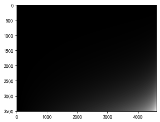

- 下边缘

注意到我们是将右图拼接到左图，重叠部分的下边缘有可能位于左图（此时权重要求为黑），也有可能位于右图（此时权重要求为白）。针对第三张测试图，我们可以计算出下边缘位于右图，因此权重图要尽可能地白。而对于其他测试图，下述权重图可能会发生变化。这一部分的判断与实现详见原始代码，本文档内不再详细说明。后续一律以第三张测试图为准。

考虑到左下角接近权重图的暗区，我们同样将其与一个能在左边缘快速变黑的左右渐变函数相乘。

```python
weight_bottom = long_light_map(tb_lin, a) * short_dark_map(lr_lin, a)
```

由此而得的权重图如下所示：

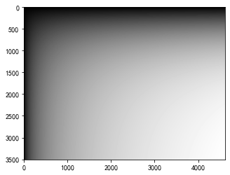

- 左边缘

左边缘的大部分区域一定位于左图内，我们需要让权重图的左边缘尽可能地黑。考虑到左下角接近权重图的亮区，我将其与一个能在下边缘快速变白的上下渐变函数相乘。

类似上边缘，它对总体权重图的贡献应为负，所以减一。

```python
weight_left = short_light_map(tb_lin, a) * long_dark_map(lr_lin, a)
weight_left -= 1
```

由此而得的权重图如下所示：


- 右边缘

右边缘的大部分区域一定位于右图内，我们需要让权重图的右边缘尽可能地白。考虑到右上角接近权重图的暗区，我将其与一个能在上边缘快速变黑的上下渐变函数相乘。

```python
weight_right = short_dark_map(tb_lin, a) * long_light_map(lr_lin, a)
```

由此而得的权重图如下所示：

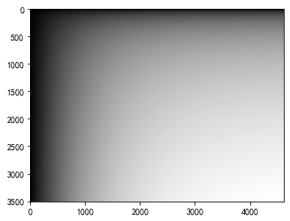

##### 边缘理想权重图加权平均得到总体权重图

在上一步，我们已经得到了各边缘的理想权重图，将其按照离边缘的远近进行加权，随后相加。

```python
weight_top *= 1-tb_lin * 1.25
weight_left *= 1-lr_lin * 1.5
weight_right *= lr_lin * 1.5
weight_bottom *= tb_lin

weight_balanced \
    = weight_top \
    + weight_bottom \
    + weight_left \
    + weight_right
```

这里的 1.25 与 1.5 均为经验常数。我们可以调节该常数来权衡各边缘的拼接质量。

得到的总体权重图如下所示：

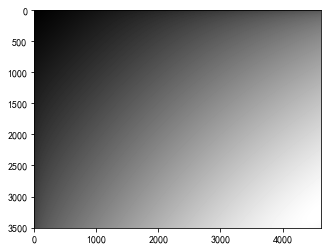

可以看到，总体权重图一定程度上符合“上边缘、左边缘为黑，右边缘、下边缘为白”的需求。为了缩短右上角和左下角的拼接线长度，我又进一步调整了权重图的均值与方差。

```python
ideal_mu = 1
ideal_sigma = 1.25
mu = np.mean(weight_balanced)
sigma = np.std(weight_balanced)
print("mu: ", mu)
print("sigma: ", sigma)
weight_balanced = (weight_balanced - mu) / sigma * ideal_sigma + ideal_mu
weight_balanced = np.minimum(weight_balanced, 1)
weight_balanced = np.maximum(weight_balanced, 0)
plt.imshow(weight_balanced, cmap="gray")
plt.show()
weight_out = np.zeros((mask.shape[0], mask.shape[1]))
weight_out[tb:bb, lb:rb] = weight_balanced
```

得到的 `weight_balanced` 如下所示：

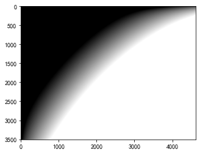

可以看到，此时的权重图基本符合之前提到的需求。根据该权重图，我得到最终的拼接结果如下：

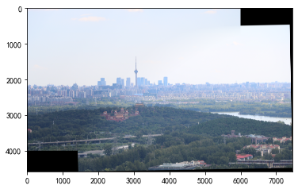

此时，拼接痕迹已经基本消除。

## 实验结果

这里附上了所有测试图片的拼接结果。可以看到，除了部分图片在角落处有轻微的痕迹外，绝大部分边缘区域的拼接效果都非常好，图片内容部分没有出现重影等情况。更精细的拼接图见 `demo.ipynb` 与 `output` 文件夹。

部分图片拉伸后较长，部分区域出现了变形。这可以对左图和右图同时做一个线性变换来解决。变换的目标可以设置为：使拼接后的图像长度最短。由于这并非PPT中提到的考察重点（考察重点为拼接后的场景连续性与光照一致性），加之期末期间时间有限，我没有对此进行进一步的实现。


