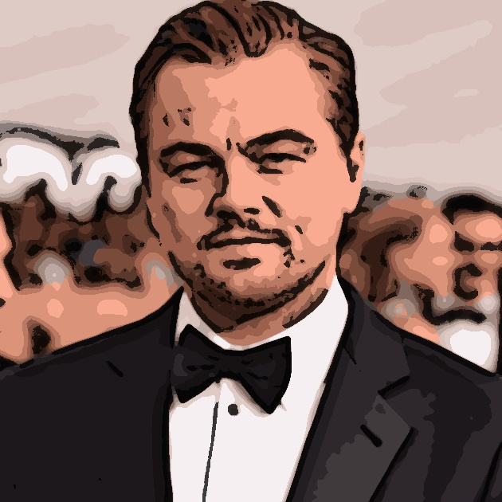

# 照片卡通化实验报告

## 实验任务

输入人脸图片或景物图片，输出卡通化处理后的图片。

## 实验方法

卡通图片一般具有以下特点：
- 颜色较为单一、鲜有变化
- 轮廓较为明朗，边缘清晰

针对第一个特点，我采用了 kmeans 聚类的方法来降低图片的颜色数目。针对第二个特点，我对输入图像进行了边缘检测，并依此增强了边缘细节。

### 颜色量化

颜色量化在原始图像上进行，主要借助了 `opencv` 库中的 `cv2.kmeans` 函数实现。

kmeans 是一种经典的无监督聚类方法，其基本思想是：
- 随机选取 k 个中心点，作为初始的聚类中心
- 对每个样本点，计算其到每个聚类中心的距离，将其归为距离最近的类别
- 对每个类别，计算所有该类别下样本点的均值，将其作为新的聚类中心
- 重复上述过程，直到满足停止条件（例如迭代次数超过限值或聚类中心不再显著变化）

通过将原始图像中所有像素点的颜色值视作样本点，应用 kmeans 算法，可以将原始图像中的颜色值聚类为 k 个类别，从而实现颜色的量化。主要代码如下：

```python
def color_quantization(img, k=8, plot=False):
    """
    color quantization

    reduce the number of colors in an image
    """
    shape = img.shape
    # reshape image to (num_pixels, 3)
    img = img.reshape((-1, 3))
    # convert to float
    img = np.float32(img)
    # define criteria
    criteria = (cv2.TERM_CRITERIA_EPS + cv2.TERM_CRITERIA_MAX_ITER, 20, 0.001)
    # apply kmeans
    ret, label, center = cv2.kmeans(img, k, None, criteria, 10, cv2.KMEANS_RANDOM_CENTERS)
    # convert back to uint8
    center = np.uint8(center)
    # flatten the labels array
    label = label.flatten()
    # reconstruct the image
    res = center[label]
    # reshape the image
    res = res.reshape(shape)
    if plot:
        plt.imshow(res)
        plt.show()
    return res
```

例如对于下图：


在进行颜色量化后，总色彩数降低到了 16 种：


这里的 16 即为上述函数中参数 `k` 的值——这是一个经验值。经过反复实验，我发现，如果继续增加 `k` 值，将导致颜色量化效果不明显，图片更显真实；如果继续减少 `k` 值，将导致图像高度抽象化，从而丢失了局部细节（例如面部特征等），色彩失真严重。

### 中值滤波

可以看到，在进行颜色量化后，图片中仍然带有大量高频信息，表现为两个颜色交界区域间过渡的色点。原本图像中的连续渐变色在量化后变成了两个颜色区域之间的色点，色点密度取决于色点离颜色边界的距离。

在真实的卡通图像中，为了避免“恐怖谷”效应，这种用于过渡颜色的色点是不常使用的，因此需要对其进行去除。我采用了 `opencv` 库中的 `cv2.medianBlur` 函数来实现中值滤波，从而去除色点。中值滤波相较高斯滤波，能在去除噪声的同时保留图像的边缘信息，适用于去除椒盐噪声。这里的色点在一定程度上可以被视作椒盐噪声，因此我采用了中值滤波的方法。

主要代码如下：

```python
img = color_quantization(img, k=k, plot=plot)
img = cv2.medianBlur(img, 7)
```

经中值滤波后，图像如下所示：


可以看到，图像更显平滑，逐渐接近卡通效果。

### 边缘检测

边缘检测主要借助了 `opencv` 库中的 `cv2.adaptiveThreshold` 函数实现。主要代码如下：

```python
def get_edge(img, blur_size=5, block_size=9, C=9, plot=False):
    """
    edge detection
    """
    # convert to grayscale
    gray = cv2.cvtColor(img, cv2.COLOR_RGB2GRAY)
    # blur the image
    blur = cv2.medianBlur(gray, blur_size)
    # detect edges
    edge = cv2.adaptiveThreshold(blur, 255, cv2.ADAPTIVE_THRESH_MEAN_C, cv2.THRESH_BINARY, block_size, C)
    if plot:
        plt.imshow(edge, cmap='gray')
        plt.show()
    return edge
```

从代码中，我们可以看到，在进行边缘检测之前，我对原始图像做了一次中值滤波。这主要是为了去除图像中的高频细节，凸显边缘信息。我也尝试了将这次中值滤波放在边缘检测之后（在边缘图上进行），但效果不如上述方法。

通过调整函数中的 `blur_size`，`block_size` 和 `C`，可以实现不同的边缘效果：
- 当 `block_size` 较大时，边缘图中线条更粗
- 当 `C` 较小时，边缘图中信息更丰富；如果 `C` 过小，将出现大量高频噪声

经过反复实验，这里选取了两组比较合适的参数，分别对应“粗线条”和“细线条”两种效果：

**粗线条**

```python
edge1 = get_edge(img, 7, 45, 8, plot=plot)
```

对于粗线条，`block_size` 和 `C` 值均较大。效果如下：


**细线条**

```python
edge2 = get_edge(img, 7, 15, 5, plot=plot)
```

对于细线条，`block_size` 和 `C` 值均较小。效果如下：


可以看到，如果类比中国传统国画，
- 粗线条能够展现出原图的“神韵”，富有立体感，但细节信息相对较少
- 细线条则类似“精笔勾画”，保留了更多细节信息，但带有一些噪声

为了减少细线条图中的噪声，我进一步用粗线条图对其进行了一次过滤。经过这一次过滤，能一定程度上减少最终输出图中突兀的“黑斑点”。


### 轮廓/边缘加强

为了兼顾立体感与细节，我选择同时使用两种边缘图。具体的使用方法如下：
- 先以一半的强度叠加粗线条边缘图，得到轮廓加深后的图像
- 在轮廓加深图基础上，以一半的强度叠加细线条边缘图来加强边缘，得到最终的卡通图

例如，对于下面这张经过颜色量化-中值滤波后的图像：


按下述代码叠加粗线条边缘图：

```python
edge1 = cv2.bitwise_and(img, img, mask=edge1)
img = cv2.addWeighted(img, 0.5, edge1, 0.5, 0)
```

得到轮廓加深图：


可以看到，图像的卡通化效果得到了显著提升。但是，细节信息仍然不够丰富，因此需要进一步加强边缘。按下述代码叠加细线条边缘图：

```python
edge2 = cv2.bitwise_and(img, img, mask=edge2)
img = cv2.addWeighted(img, 0.5, edge2, 0.5, 0)
```

得到最终的卡通图：


可以看到，图像的边缘得到了进一步加强，贴近手绘卡通图效果。

## 实验结果

我对测试的 10 张图片分别进行了卡通化处理，得到的结果如下：





